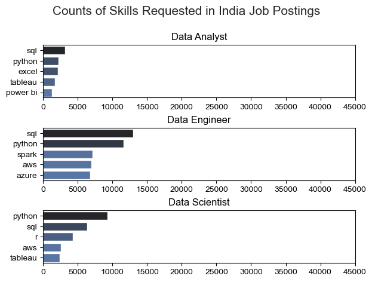
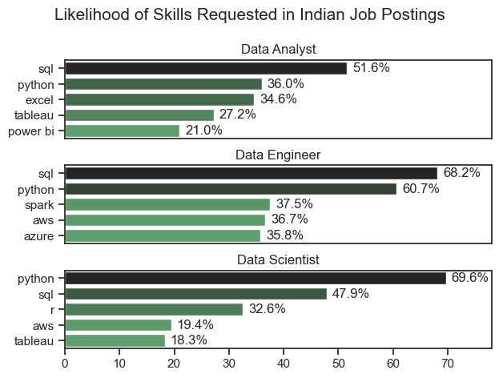
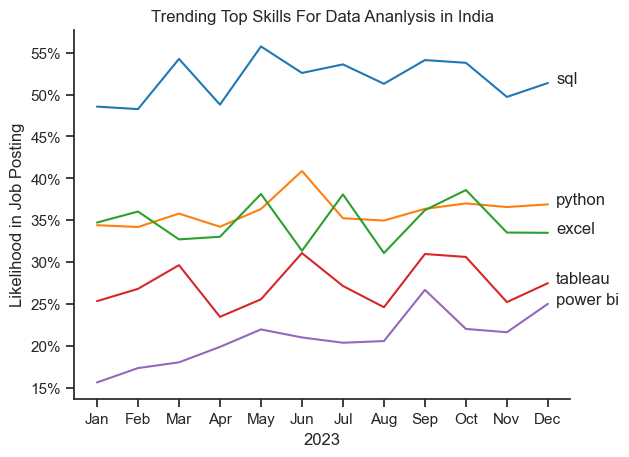

# 📊 Skill Demand Analysis in Indian Job Postings

This project analyzes job listings from India to identify the most in-demand technical skills across various job roles. Using Python-based data processing and visualization tools, it presents both raw skill frequencies and normalized percentages to reveal deeper insights into industry expectations.

---

## 📁 Dataset

The dataset used is `data_jobs.csv`, which contains job postings scraped from multiple online sources. Each record includes:

- 🧠 `job_title_short` – Simplified job title (e.g., Data Scientist, Data Analyst)
- 🛠 `job_skills` – A list of skills required for the job
- 🌍 `job_country` – Country of the job listing
- 💰 `salary_in_usd` – (Optional) salary details
- 📅 `job_posted_date` – Date when the job was posted

---

## 🛠️ Tools & Libraries

- **Pandas** – For data wrangling and transformation
- **Matplotlib** – For basic visualizations
- **Seaborn** – For enhanced, styled visualizations
- **AST** – To safely convert stringified lists into actual Python lists

---

## 🔍 What This Project Does

## 1. 🇮🇳 Focus on Indian Job Listings
Filters data to only include jobs from **India** for focused analysis.

## 2. 💥 Skill Frequency Analysis
- Explodes the `job_skills` list so each skill becomes a row.
- Groups by both `job_skills` and `job_title_short` to count how many times each skill appears per role.

## 3. 📊 Visualization 1: **Top 5 Most Common Skills per Job Title**
- Picks the top 3 job titles with the most listings.
- For each, plots the **top 5 most frequently mentioned skills**.
- Uses horizontal bar charts for better readability.

## 4. 📈 Visualization 2: **Skill Percentage Likelihood**
- Normalizes skill mentions by dividing `skill_count` by total jobs for that title.
- Plots **likelihood (%)** that a job of a certain title will request a given skill.
- Adds percentage labels next to each bar.
---

## 🔹 Skill Count Plot:

## 🔸 Skill Percentage Plot:

---

## Insight

📊 Plot 1: Counts of Skills Requested in Indian Job Postings
This chart shows raw frequency of skill mentions in the top 3 most common job titles.

✅ Data Analyst:
SQL dominates with the highest mentions.

Python and Excel are closely tied in demand.

Tableau and Power BI appear as popular BI tools but with fewer mentions.

✅ Data Engineer:
SQL and Python remain dominant, with SQL slightly ahead.

Spark, AWS, and Azure indicate strong demand for big data and cloud skills.

✅ Data Scientist:
Python is the most requested skill, reaffirming its central role.

SQL and R are still relevant.

Cloud and visualization tools like AWS and Tableau show modest demand.

📈 Plot 2: Likelihood of Skills Requested (%-based Normalized View)
This plot normalizes skill counts by the total number of job postings for each role, giving a true sense of how likely a skill is to appear in a posting for that role.

✅ Data Analyst:
Over 51% of job listings require SQL.

Python and Excel are nearly equally important (~35%).

Tableau and Power BI show moderate demand (~21–27%).

✅ Data Engineer:
SQL is required in 68% of job posts — the highest among all titles.

Python follows closely at 60%.

Spark, AWS, and Azure all hover between 35–37%, showing demand for distributed computing and cloud platforms.

✅ Data Scientist:
Python dominates with a 69.6% requirement rate.

SQL is also important (47.9%), followed by R at 32.6%.

Cloud & BI tools like AWS (19.4%) and Tableau (18.3%) trail behind, indicating they're desirable but not mandatory.

### 📈 Monthly Trends of Top Skills in Data Analyst Jobs (India)
This part of the analysis explores how the demand for key skills changes across months in 2023 for Data Analyst roles in India.

## 🔄 How It Works
The dataset is filtered to include only Data Analyst roles in India.

The job_skills column is exploded so that each row represents a single skill per job post.

A pivot table is created to count how often each skill appears per month.

These counts are normalized by the total number of job listings that month, giving the likelihood (%) of each skill being mentioned.

The top 5 skills with the highest total mentions are selected.

A line chart is plotted to show how the importance of each skill trends across the year.

📊 Visualization: Skill Trends Over Time

## Monthly Trend of Top 5 Skills in Data Analyst Job Postings (India, 2023)

## Insight
SQL consistently remained the most in-demand skill for Data Analyst roles in India throughout 2023, appearing in over 50% of job postings. Python and Excel followed closely, with Python peaking mid-year. Tableau and Power BI had lower but gradually increasing mentions, indicating growing interest in data visualization tools.
